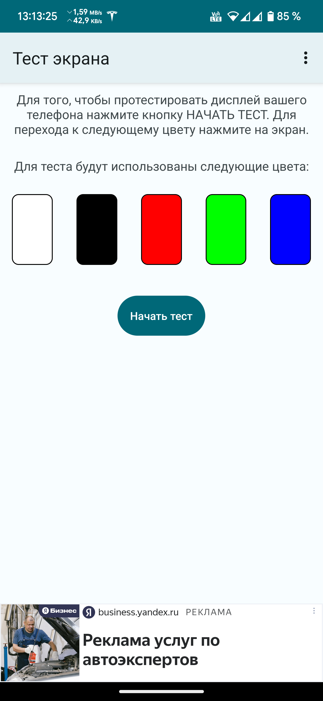
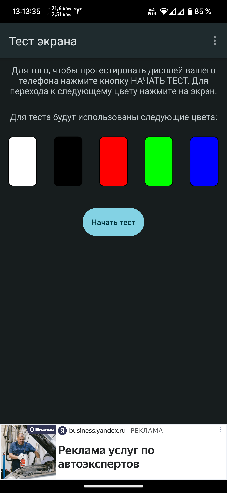
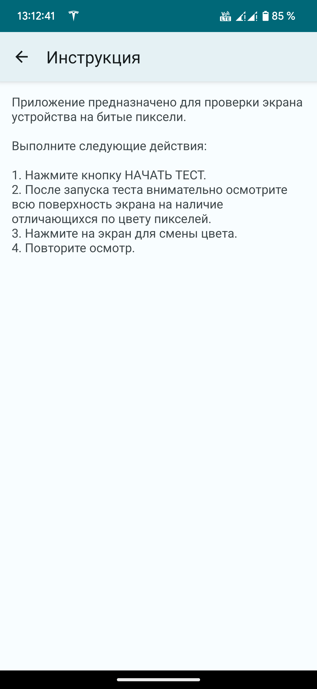

# Мобильное приложение "Тест экрана на битые пиксели"

## Описание проекта

С помощью этого приложения можено протестировать экран устройства на "битые пиксели".

## Инструкция

Выполните следующие действия:

1. **Нажмите кнопку НАЧАТЬ ТЕСТ.**
2. После запуска теста внимательно осмотрите всю поверхность экрана на наличие отличающихся по цвету пикселей.
3. **Нажмите на экран для смены цвета.**
4. Повторите осмотр.

## Технологии

- **Язык программирования:** Kotlin
- **Рекламные технологии:** Yandex Mobile Ads SDK
- **Дизайн:** Material You
- **Динамический цвет:** Поддержка динамического изменения цветовой схемы в зависимости от обоев и темы устройства
- **Система навигации:** Predictive Back Gesture — поддержка жестов для предсказуемой навигации назад


## Ссылки на Google Play и RuStore

Вы можете скачать и установить приложение "Тест экрана на битые пиксели" через [Google Play Store](https://play.google.com/store/apps/details?id=com.den.shak.displaytest) или [RuStore](https://www.rustore.ru/catalog/app/com.den.shak.displaytest) .

## Скриншоты

Ниже представлены скриншоты приложения "Цена вопроса":

<table>
  <tr>
    <td></td>
    <td></td>
    <td></td>
  </tr>
  <tr>
    <td></td>
    <td></td>
    <td></td>
  </tr>
</table>

## Инструкция по сборке проекта

1. **Клонируйте репозиторий:**
   ```
   git clone https://github.com/Den-88/Displaytest
2. **Откройте проект в Android Studio:**
   - В главном меню выберите **"Open an existing project"** и укажите путь к проекту.

3. **Синхронизируйте Gradle:**
   - Когда появится уведомление, нажмите **"Sync Now"** для загрузки всех зависимостей.

4. **Соберите и запустите проект:**
   - Выберите режим сборки (`Debug` или `Release`).
   - Нажмите **"Run"**, чтобы начать выполнение на устройстве или эмуляторе.

## Разработчик
- **Шакуров Денис Дамирович**
